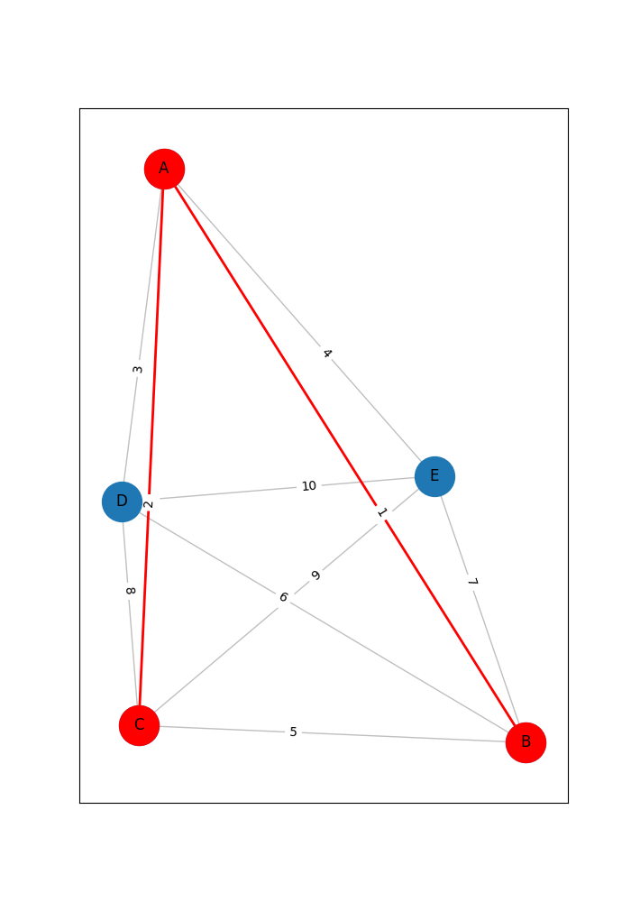
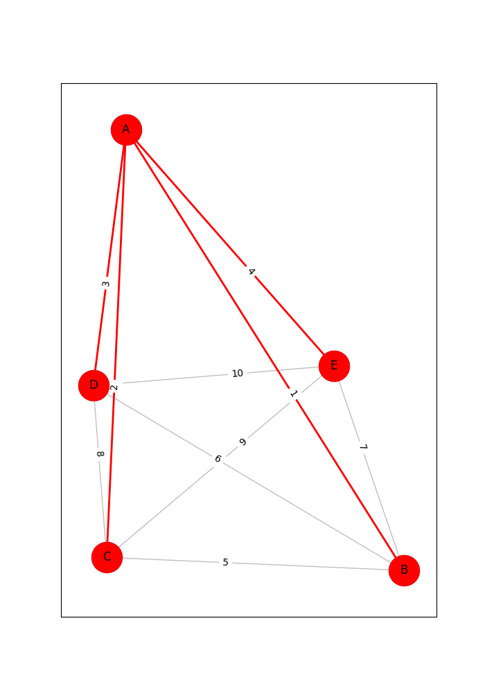

## Minimum Spanning Tree by Kruskal's Algorithm

This is a simple implementation of Kruskal's algorithm for finding the minimum spanning tree of a graph. The algorithm is implemented in python

## Usage

The algorithm is implemented in the file `Graph.py`. The file `Plot.py` is implemented each step for drawing spanning tree .The file `App.py` is main file for running the program.

## Input
A graph have n vertices and is connected. Vertices are labeled by characters from A to Z.Each edge is represented by a line containing the two vertices and the weight of the edge.
*    5     - number of vertices
*    A B 1 - edge A-B with weight 1
*    A C 2 - edge A-C with weight 2
*    A D 3 - edge A-D with weight 3
*    A E 4 - edge A-E with weight 4
*    B C 5 - edge B-C with weight 5
*    B D 6 - edge B-D with weight 6
*    B E 7 - edge B-E with weight 7
*    C D 8 - edge C-D with weight 8
*    C E 9 - edge C-E with weight 9
*    D E 10 - edge D-E with weight 10
## Output
Each step figure building spanning tree :

### Step 1

### Step 2

### Step 3

### Step 4

